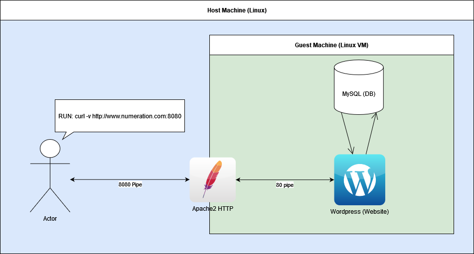

# DevSecOps TP B3-DEV-B Groupe D



# Quickstart

## Requirements

- Linux
- VirtualBox
- Vagrant
- Ansible
- Curl

## Configuration

> You must use a non **root** user

Move ssh keys in your home folder to authenticate
in vagrant guest vm after 

```sh
(TP) $ mv ./2/tp-devsecops* ~/.ssh
```

Add host dns alias

```sh
(TP) $ sudo echo "127.0.0.1 www.numeration.com numeration.com" >> /etc/hosts
```

## Launching

```sh
(TP) $ cd ./1
(TP) $ vagrant up
```

## Test

> The test currently the 8080 port because Vagrant cannot forward low level port (80) in host

```sh
(TP) $ curl -v http://www.numeration.com:8080 && echo $?
(TP) $ curl -v http://numeration.com:8080 && echo $?
```